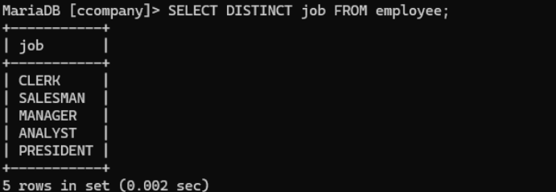
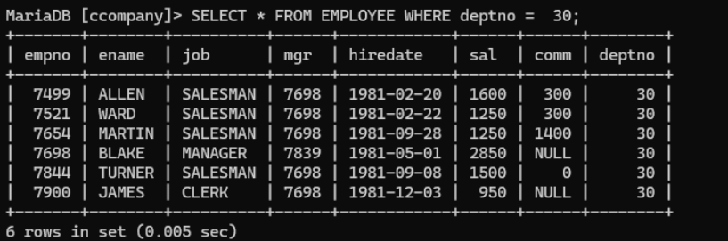
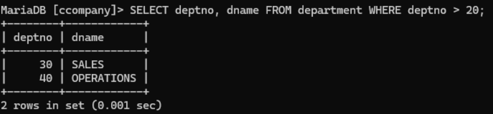
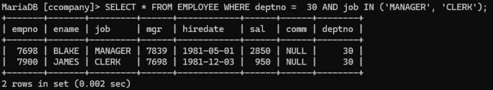
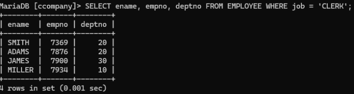
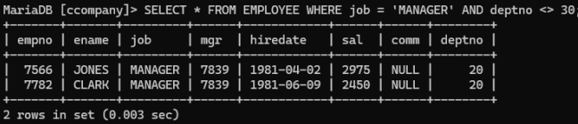
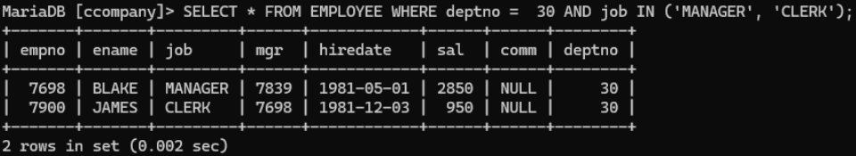
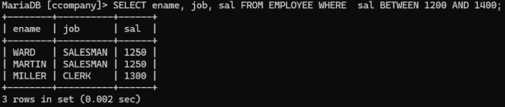
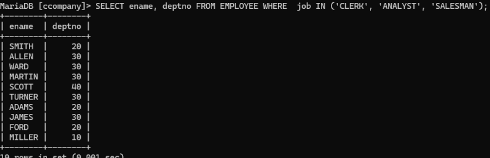
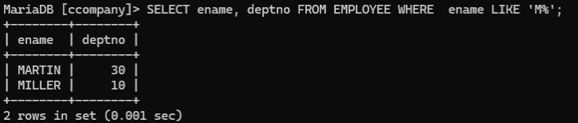

# Experiment 2

## Aim
To retrieve data from the EMPLOYEE table using various SQL SELECT queries with conditions.

---

## Theory
SQL provides the SELECT statement to retrieve data from a database. Various clauses such as WHERE, DISTINCT, and logical operators help filter and display specific records.

In this experiment:
- Data is retrieved using SELECT statements.
- Conditions are applied using WHERE clause.
- Logical operators (AND, OR, NOT) are used.
- Pattern matching and filtering techniques are applied.

---

## Experiment Questions
1. List all distinct jobs in Employee.
2. List all information about employees in Department 30.
3. Find all department numbers with department names greater than 20.
4. Find all managers and clerks in Department 30.
5. List employee name, number, and department of all clerks.
6. Find managers not in Department 30.
7. List employees in Department 10 who are not managers or clerks.
8. Find employees earning between 1200 and 1400.
9. List employees who are clerks, analysts, or salesmen.
10. List employees whose names begin with 'M'.

---

## Queries

### 1. List all distinct jobs
```sql
SELECT DISTINCT JOB FROM EMPLOYEE;
```


---

### 2. Employees in Department 30
```sql
SELECT * FROM EMPLOYEE
WHERE DEPTNO = 30;
```


---

### 3. Department number and name greater than 20
```sql
SELECT DEPTNO, DNAME FROM DEPARTMENT
WHERE DEPTNO > 20;
```


---

### 4. Managers and Clerks in Department 30
```sql
SELECT * FROM EMPLOYEE
WHERE DEPTNO = 30 AND (JOB = 'MANAGER' OR JOB = 'CLERK');
```


---

### 5. Clerks details
```sql
SELECT ENAME, EMPNO, DEPTNO FROM EMPLOYEE
WHERE JOB = 'CLERK';
```


---

### 6. Managers not in Department 30
```sql
SELECT * FROM EMPLOYEE
WHERE JOB = 'MANAGER' AND DEPTNO <> 30;
```


---

### 7. Employees in Dept 10 not Manager or Clerk
```sql
SELECT * FROM EMPLOYEE
WHERE DEPTNO = 10 AND JOB NOT IN ('MANAGER', 'CLERK');
```


---

### 8. Employees earning between 1200 and 1400
```sql
SELECT ENAME, JOB FROM EMPLOYEE
WHERE SAL BETWEEN 1200 AND 1400;
```


---

### 9. Clerks, Analysts, or Salesmen
```sql
SELECT ENAME, DEPTNO FROM EMPLOYEE
WHERE JOB IN ('CLERK', 'ANALYST', 'SALESMAN');
```


---

### 10. Names starting with M
```sql
SELECT ENAME, DEPTNO FROM EMPLOYEE
WHERE ENAME LIKE 'M%';
```


---

## Output
- Successfully retrieved data using SELECT queries.
- Applied filtering using WHERE clause.
- Used logical and comparison operators effectively.

---

## Result
Successfully executed SQL retrieval queries using conditions, logical operators, and pattern matching.