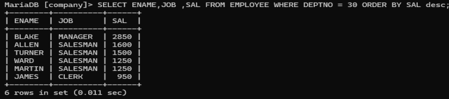
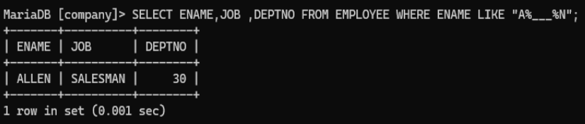
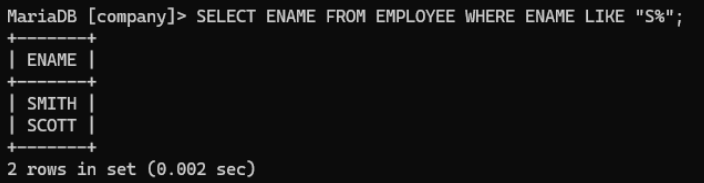
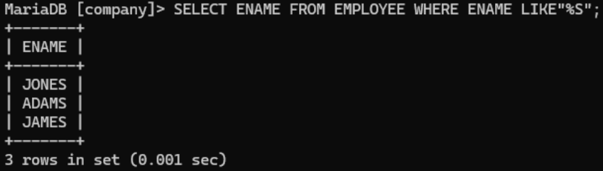
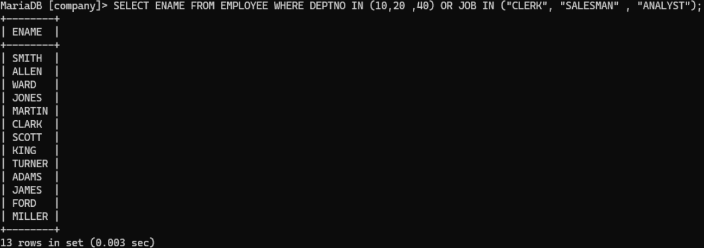
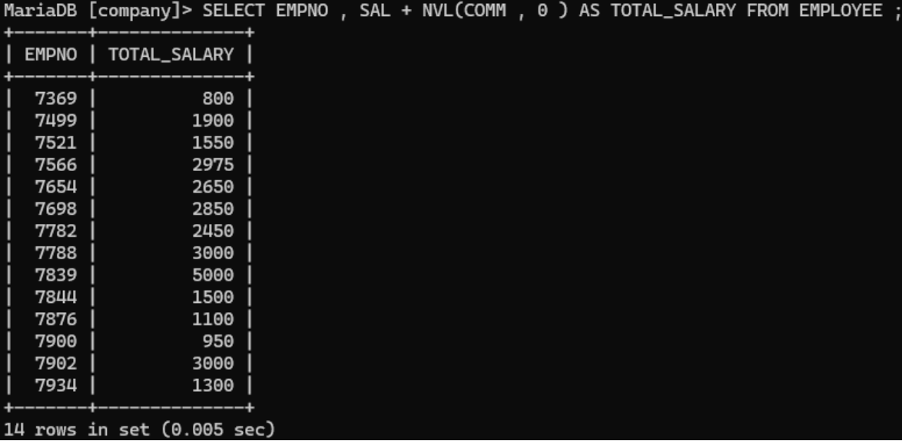
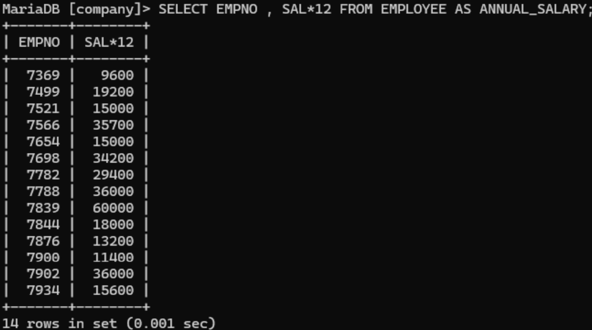
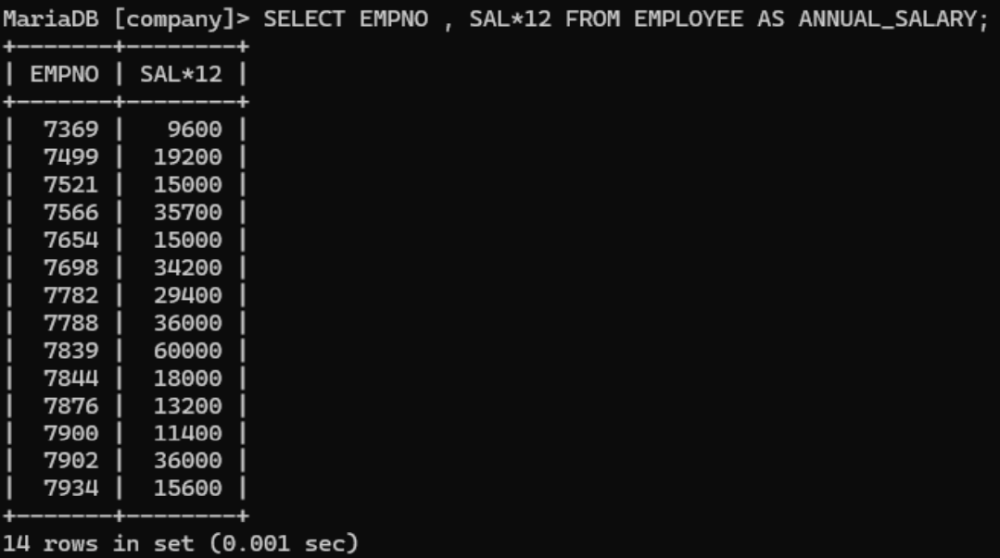

# Experiment 3

## Aim
To retrieve and sort data from the EMPLOYEE table using ORDER BY, pattern matching, and conditional queries.

---

## Theory
SQL provides powerful clauses like ORDER BY for sorting and LIKE for pattern matching. These help in organizing and filtering data effectively.

In this experiment:
- Data is sorted using ORDER BY.
- Pattern matching is done using LIKE.
- Logical conditions are applied for filtering records.

---

## Experiment Questions
1. List all employees and jobs in Department 30 in descending order by salary.
2. List job and department number of employees whose names are five letters long, begin with 'A' and end with 'N'.
3. Display names of employees whose names start with 'S'.
4. Display names of employees whose names end with 'S'.
5. Display employees working in departments 10, 20, or 40 or working as clerks, salesmen, or analysts.
6. Display employee number and names for employees who earn commission.
7. Display employee number and total salary for each employee.
8. Display employee number and annual salary for each employee.
9. Display names of clerks earning more than 3000.
10. Display names of clerks, salesmen, or analysts earning more than 3000.

---

## Queries

### 1. Employees in Dept 30 sorted by salary (descending)
```sql
SELECT ENAME, JOB, SAL
FROM EMPLOYEE
WHERE DEPTNO = 30
ORDER BY SAL DESC;
```


---

### 2. Names with 5 letters, start with A and end with N
```sql
SELECT JOB, DEPTNO
FROM EMPLOYEE
WHERE ENAME LIKE 'A___N';
```


---

### 3. Names starting with S
```sql
SELECT ENAME
FROM EMPLOYEE
WHERE ENAME LIKE 'S%';
```


---

### 4. Names ending with S
```sql
SELECT ENAME
FROM EMPLOYEE
WHERE ENAME LIKE '%S';
```


---

### 5. Employees in given departments or jobs
```sql
SELECT *
FROM EMPLOYEE
WHERE DEPTNO IN (10, 20, 40)
   OR JOB IN ('CLERK', 'SALESMAN', 'ANALYST');
```


---

### 6. Employees earning commission
```sql
SELECT EMPNO, ENAME
FROM EMPLOYEE
WHERE COMM IS NOT NULL;
```


---

### 7. Employee number and total salary
```sql
SELECT EMPNO, (SAL + NVL(COMM, 0)) AS TOTAL_SALARY
FROM EMPLOYEE;
```


---

### 8. Employee number and annual salary
```sql
SELECT EMPNO, (SAL * 12) AS ANNUAL_SALARY
FROM EMPLOYEE;
```


---

### 9. Clerks earning more than 3000
```sql
SELECT ENAME
FROM EMPLOYEE
WHERE JOB = 'CLERK' AND SAL > 3000;
```


---

### 10. Clerks, Salesmen, Analysts earning more than 3000
```sql
SELECT ENAME
FROM EMPLOYEE
WHERE JOB IN ('CLERK', 'SALESMAN', 'ANALYST')
AND SAL > 3000;
```


---

## Output
- Data successfully sorted using ORDER BY.
- Pattern matching performed using LIKE operator.
- Conditional queries executed using logical operators and functions.

---

## Result
Successfully executed SQL queries involving sorting, pattern matching, and conditional filtering.